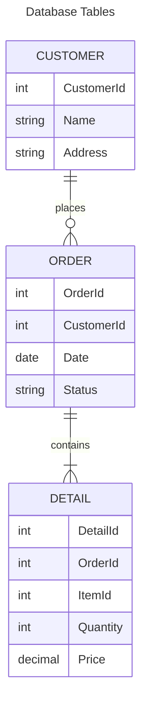
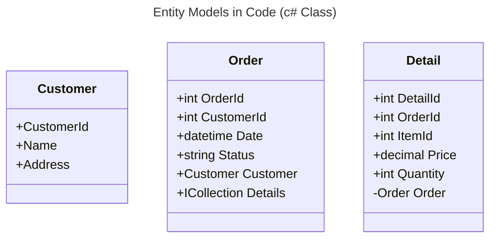
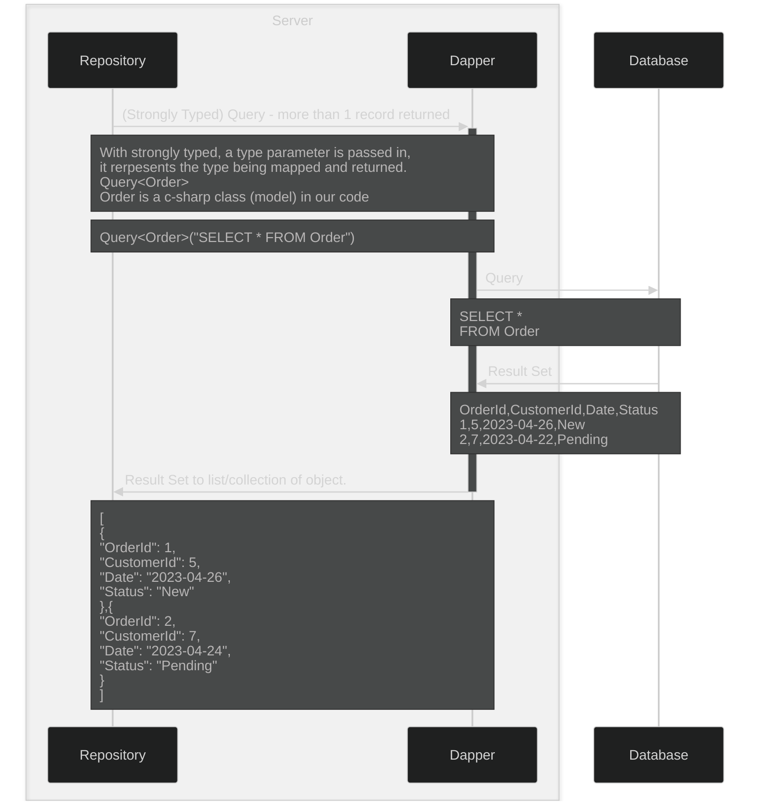
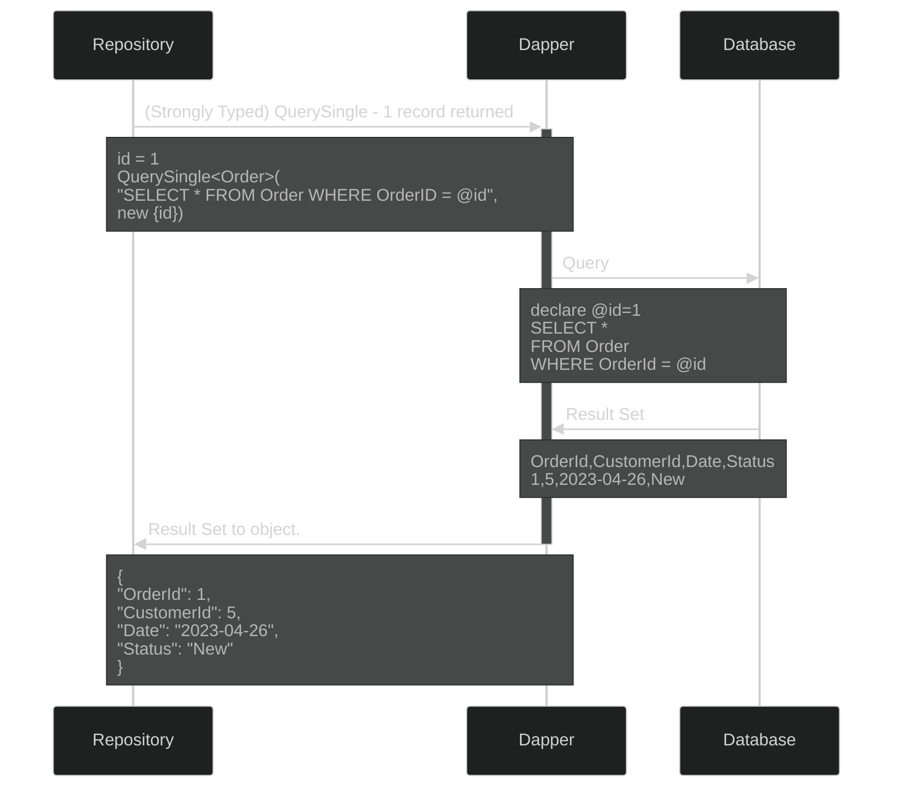
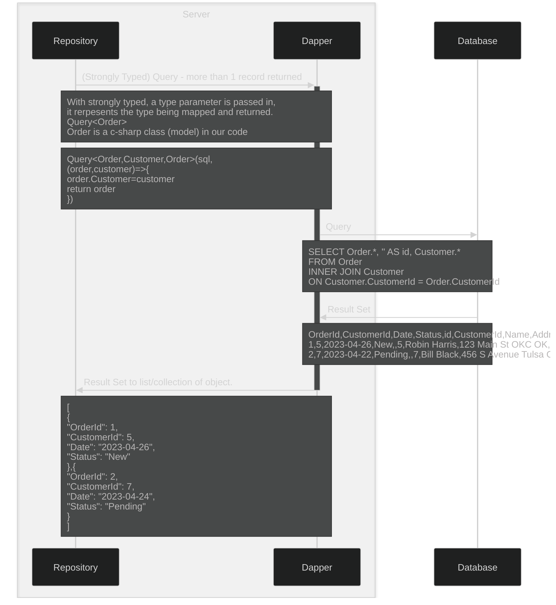
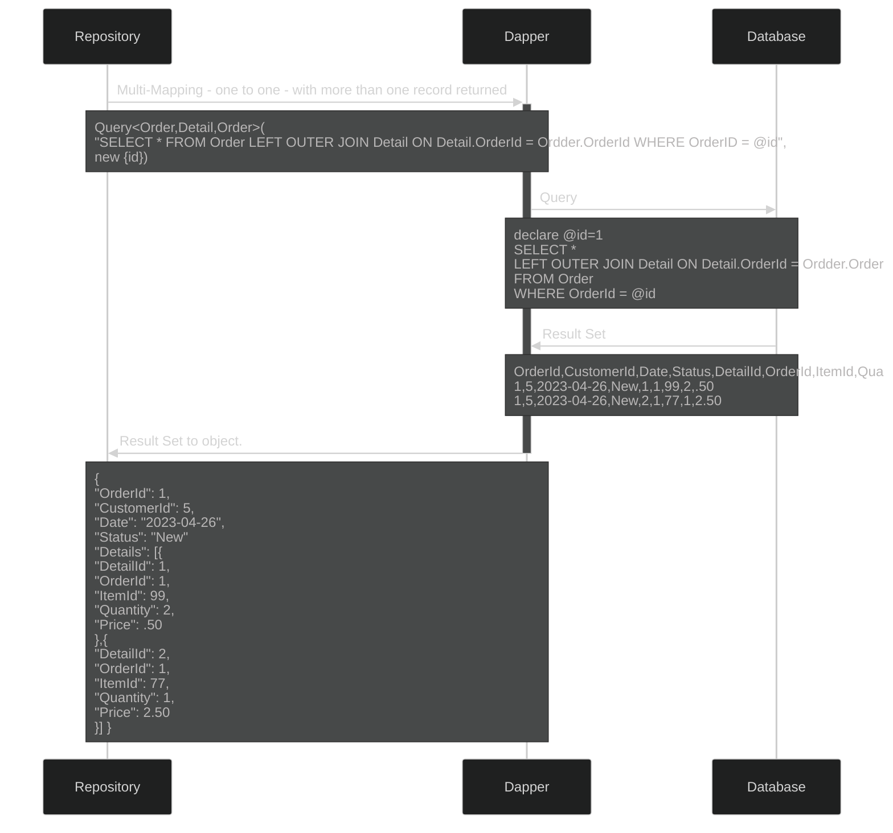

[Strongly Typed - Query - multiple returned](https://dapper-tutorial.net/result-strongly-typed#example-query)

[Strongly Typed - QuerySingle - one returned](https://dapper-tutorial.net/result-strongly-typed#example-querysingle)

[Multi-Mapping - One to One - multiple returned](https://dapper-tutorial.net/result-multi-mapping#example-query-multi-mapping-one-to-one)

[Multi-Mapping - One to Many - multiple returned](https://dapper-tutorial.net/result-multi-mapping#example-query-multi-mapping-one-to-many)

[Multi-Result](https://dapper-tutorial.net/result-multi-result)

