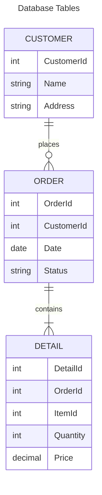
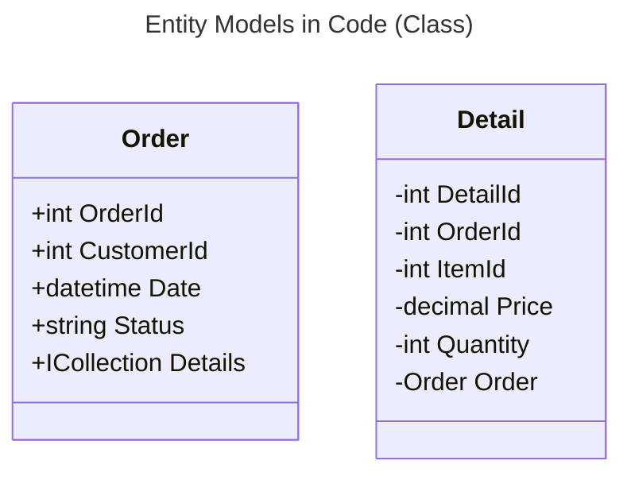
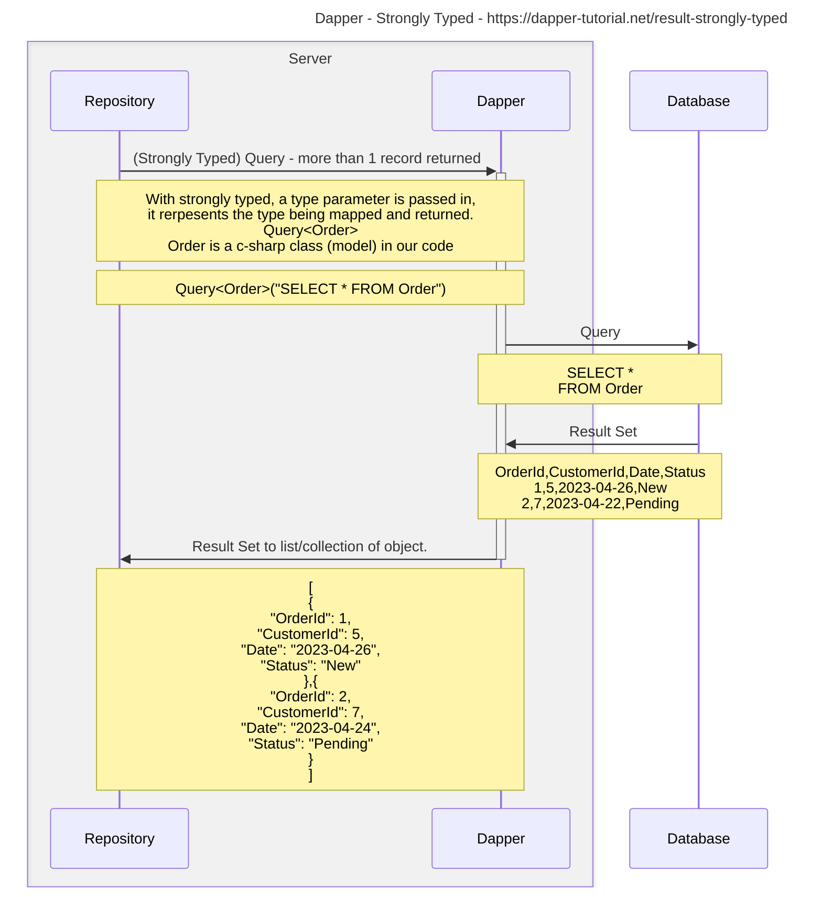
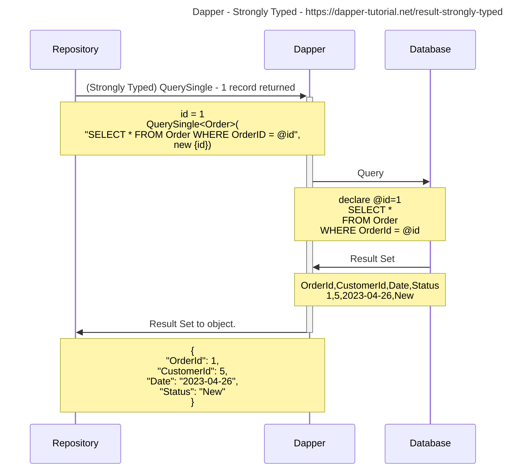
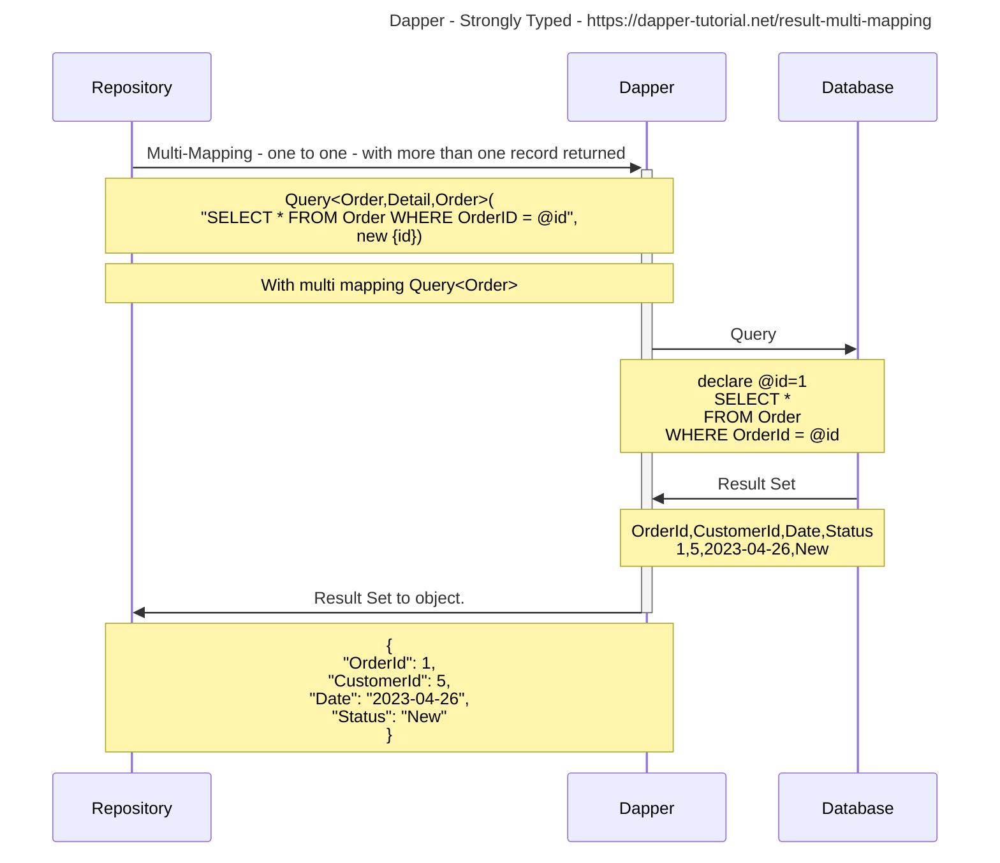

```mermaid
---
title: Database Tables
---
erDiagram

    CUSTOMER ||--o{ ORDER : places
    CUSTOMER {
         int CustomerId
         string Name
         string Address
    }
    
    ORDER ||--|{ DETAIL : contains
    ORDER {
        int OrderId
        int CustomerId
        date Date
        string Status
    }

    DETAIL {
        int DetailId
        int OrderId
        int ItemId
        int Quantity
        decimal Price
    }
```

```mermaid
---
title: Entity Models in Code (Class)
---
classDiagram
    class Order{
        +int OrderId
        +int CustomerId
        +datetime Date
        +string Status
        +ICollection<Detail> Details
    }
    class Detail{
        -int DetailId
        -int OrderId
        -int ItemId
        -decimal Price
        -int Quantity
        -Order Order
    }
```

```mermaid
---
title: Dapper - Strongly Typed - https://dapper-tutorial.net/result-strongly-typed
---
sequenceDiagram

box rgba(60,60,60,.05) Server 
    participant Repository
    participant Dapper
end
participant Database
    #dividing line
    Repository->>+Dapper: (Strongly Typed) Query - more than 1 record returned
        Note over Repository,Dapper: With strongly typed, a type parameter is passed in,<br> it rerpesents the type being mapped and returned.<br> Query<Order><br>Order is a c-sharp class (model) in our code
        Note over Repository,Dapper: Query<Order>("SELECT * FROM Order")
        Dapper->>Database: Query
          Note over Dapper,Database: SELECT *<br>FROM Order
        Database->>Dapper: Result Set
          Note over Dapper,Database: OrderId,CustomerId,Date,Status<br>1,5,2023-04-26,New<br>2,7,2023-04-22,Pending
    Dapper->>-Repository: Result Set to list/collection of object.
      Note over Dapper,Repository: [<br> {<br>"OrderId": 1,<br>"CustomerId": 5,<br>"Date": "2023-04-26",<br>"Status": "New"<br>},{<br>"OrderId": 2,<br>"CustomerId": 7,<br>"Date": "2023-04-24",<br>"Status": "Pending"<br>}<br>]

```

```mermaid
---
title: Dapper - Strongly Typed - https://dapper-tutorial.net/result-strongly-typed
---
sequenceDiagram

    Repository->>+Dapper: (Strongly Typed) QuerySingle - 1 record returned
        Note over Repository,Dapper: id = 1<br>QuerySingle<Order>(<br>"SELECT * FROM Order WHERE OrderID = @id",<br>new {id})
        Dapper->>Database: Query
          Note over Dapper,Database: declare @id=1<br>SELECT *<br>FROM Order<br>WHERE OrderId = @id
        Database->>Dapper: Result Set
          Note over Dapper,Database: OrderId,CustomerId,Date,Status<br>1,5,2023-04-26,New
    Dapper->>-Repository: Result Set to object.
      Note over Dapper,Repository: {<br>"OrderId": 1,<br>"CustomerId": 5,<br>"Date": "2023-04-26",<br>"Status": "New"<br>}

```

```mermaid
---
title: Dapper - Strongly Typed - https://dapper-tutorial.net/result-multi-mapping
---
sequenceDiagram

    Repository->>+Dapper: Multi-Mapping - one to one - with more than one record returned
        Note over Repository,Dapper: Query<Order,Detail,Order>(<br>"SELECT * FROM Order WHERE OrderID = @id",<br>new {id})
        Note over Repository,Dapper: With multi mapping Query<Order>
        Dapper->>Database: Query
          Note over Dapper,Database: declare @id=1<br>SELECT *<br>FROM Order<br>WHERE OrderId = @id
        Database->>Dapper: Result Set
          Note over Dapper,Database: OrderId,CustomerId,Date,Status<br>1,5,2023-04-26,New
    Dapper->>-Repository: Result Set to object.
      Note over Dapper,Repository: {<br>"OrderId": 1,<br>"CustomerId": 5,<br>"Date": "2023-04-26",<br>"Status": "New"<br>}
```
